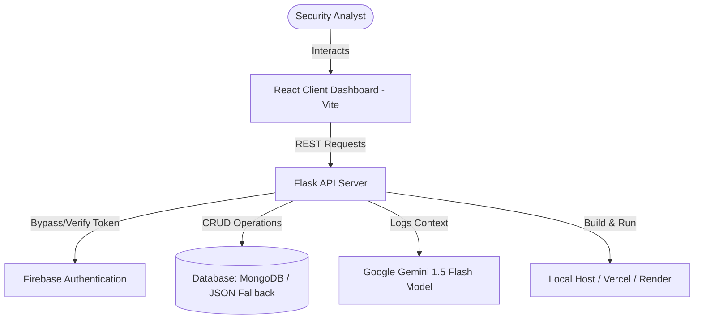

#  SentinelAI

[](https://vercel.com)
[](https://render.com)
[](https://opensource.org/licenses/MIT)
[](https://github.com)
[](https://github.com)
[](https://github.com)

**SentinelAI** is an enterprise-grade insider threat intelligence and behavior trust score analytics platform. It dynamically monitors and parses security event logs, tracks behavioral shifts across user profiles, and triggers automated AI incident investigation playbooks powered by Google Gemini models to mitigate threats before data exfiltration occurs.

---

## 🔗 Quick Links

<p align="left">
  <a href="http://localhost:5173">
    
  </a>
  <a href="file:///c:/Users/PRathmesh/Desktop/FINSpark/docs/architecture.md">
    
  </a>
  <a href="https://github.com">
    
  </a>
  <a href="https://youtube.com">
    
  </a>
</p>

---

## 🗺️ Table of Contents

- [About The Project](#about-the-project)
- [Key Features](#key-features)
- [Screenshots](#screenshots)
- [Architecture](#architecture)
- [Tech Stack](#tech-stack)
- [Folder Structure](#folder-structure)
- [Installation](#installation)
- [Environment Variables](#environment-variables)
- [Usage](#usage)
- [API Documentation](#api-documentation)
- [Database Design](#database-design)
- [AI / Machine Learning](#ai--machine-learning)
- [Performance](#performance)
- [Security](#security)
- [Future Roadmap](#future-roadmap)
- [Testing](#testing)
- [Deployment](#deployment)
- [Contributors](#contributors)
- [Contributing](#contributing)
- [License](#license)
- [Acknowledgements](#acknowledgements)
- [Contact](#contact)

---

## 🔍 About The Project

SentinelAI addresses the critical vulnerability of insider threats within corporate networks. Standard security information and event management (SIEM) systems generate high-volume alert fatigue without connecting disjointed user activity logs. 

### Why It Matters
Insider threat detection is a needle-in-a-haystack problem. An employee performing unauthorized midnight logins, downloading larger-than-normal codebases, and uploading files to external services represents an active data breach path. SentinelAI correlates these events chronologically and maps them to a rolling Behavior Trust Score (0-100).

### Expected Impact
* **Reduced Response Time**: Lowers incident response cycles from hours to seconds through Gemini AI-generated playbooks.
* **Proactive Security posture**: Provides security analysts with early indicators before exfiltration happens.
* **High Signal, Low Noise**: Grouping routine behaviors prevents alert fatigue, highlighting only anomalous event sequences.

---

## ✨ Key Features

| Feature Name | Short Description | Benefit |
|---|---|---|
| **Behavior Trust Engine** | Dynamic algorithmic scoring (0-100) with daily decay and recovery mechanics. | Immediate visual risk classification of network users. |
| **Chronological Timelines** | Groups and collapses thousands of routine events while expanding anomalies. | Streamlines security audits by cutting out timeline noise. |
| **AI Incident Assistant** | Integrated Gemini-powered narrative and actionable SOAR playbooks. | Empowers tier-1 SOC analysts with expert mitigation steps instantly. |
| **Attack Simulator** | One-click malicious scenario injector (USB exfiltration, impossible travel). | Enables stress-testing of threat detection rules. |
| **Natural Language Search** | AI security chat interface for database profile queries. | Allows natural language threat hunting without complex SQL/NoSQL queries. |

---

## 📸 Screenshots

### Desktop & Dashboard Overview
> *Dashboard visualization with circular user trust indicators, dark mode grid styling, and Chart.js historical trend lines.*
```
+--------------------------------------------------------------------------------+
|  [SentinelAI]  Search Employees... (EMP032)                        [STATUS: OK]|
+--------------------------------------------------------------------------------+
|  EMPLOYEE PROFILES                 |  BEHAVIOR TRUST SCORE TREND OVER TIME     |
|  * EMP032 - DevOps Engineer [10/100] |  100 |-------------------               |
|  * EMP015 - Sales Rep     [27/100] |   80 |                                   |
|  * EMP055 - Developer     [53/100] |   60 |                                   |
|  * EMP102 - HR Manager    [73/100] |   40 |           \                       |
|                                    |   20 |            \_______               |
|                                    |      +--------------------------------   |
|                                    |        May 1   May 15   June 1   June 15 |
+------------------------------------+-------------------------------------------+
|  ACTIVE INVESTIGATION TIMELINE     |  GEMINI PLAYBOOK ASSISTANT                |
|  [09:12:14] USB Exfiltration (Anom)|  - Narrative: Unauthorized device access  |
|  [08:30:00] 15x Routine Web Access |  - Playbook:                              |
|  [08:15:22] Standard Logon         |    1. Freeze LDAP User Credentials.       |
|                                    |    2. Terminate active sessions.          |
+--------------------------------------------------------------------------------+
```

---

## 🏗️ Architecture



---

## 🛠️ Tech Stack

| Component | Technology | Description |
|---|---|---|
| **Frontend** | React 19, Vite, Tailwind CSS v3 | High-fidelity Single Page Application (SPA). |
| **Charts** | Chart.js, react-chartjs-2 | Visualizes historical employee trust score trends. |
| **Backend** | Python, Flask, Flask-CORS | API controller routing core logic. |
| **Rate Limiter**| Flask-Limiter | Prevents brute-force endpoint attacks. |
| **Database** | MongoDB / PyMongo | Unified document store with indexed query collections. |
| **AI Core** | Google Gemini API (google-generativeai)| Generates playbooks and natural language queries. |
| **Auth** | Firebase Admin SDK | Handles JWT identity authorization tokens. |
| **Testing** | Python unittest | Comprehensive unit and integration test suite. |

---

## 📂 Folder Structure

```
FINSpark/
├── .env.example              # Template for system environment variables
├── .gitignore                # Excludes cache, logs, and secrets from version control
├── README.md                 # Project root documentation
├── start_platform.bat        # Windows shortcut script to launch full stack
├── backend/                  # Python Flask API service
│   ├── app.py                # Server routes, CORS, rate limits
│   ├── db_client.py          # MongoDB configuration & JSON mock fallback class
│   ├── trust_score.py        # Behavior trust mathematical engine
│   ├── timeline.py           # Log collapsing chronological scheduler
│   ├── ai_assistant.py       # Gemini API caller and rule playbooks fallback
│   ├── requirements.txt      # Python dependencies
│   └── mock_db/              # Fallback database storage when MongoDB is offline
├── frontend/                 # React SPA Client
│   ├── package.json          # Node dependencies
│   ├── tailwind.config.js    # Customized dark theme layout classes
│   ├── vercel.json           # Vercel SPA router config
│   ├── src/
│   │   ├── main.jsx          # DOM mounting controller
│   │   ├── App.jsx           # Unified React visual components
│   │   └── index.css         # CSS stylesheets and fonts
│   └── public/
├── scripts/                  # Data generators and pipeline imports
│   ├── generate_synthetic_data.py
│   ├── import_data.py
│   └── recalculate_all_scores.py
├── tests/                    # Automation test suits
│   └── test_backend.py
└── docs/                     # System architecture and design documentation
    ├── architecture.md
    ├── database_schema.md
    ├── deployment.md
    └── final_summary.md
```

---

## ⚙️ Installation

### 1. Clone the Repository
```bash
git clone https://github.com/username/FINSpark.git
cd FINSpark
```

### 2. Configure Environment Variables
Copy `.env.example` to `.env` at the root of the project:
```bash
copy .env.example .env
```
Open `.env` and configure your credentials (e.g., your Gemini API key).

### 3. Run Ingestion Pipeline (Optional)
This generates synthetic log records and imports them into your database fallback.
```bash
python scripts/generate_synthetic_data.py
python scripts/import_data.py --reset
```

### 4. Install Dependencies
**Backend Dependencies**:
```bash
pip install -r backend/requirements.txt
```

**Frontend Dependencies**:
```bash
cd frontend
npm install
cd ..
```

### 5. Launch the Platform
Double-click `start_platform.bat` or run:
```bash
# In terminal 1 (Backend):
python backend/app.py

# In terminal 2 (Frontend):
cd frontend
npm run dev
```
Open your browser to `http://localhost:5173`.

---

## 🔑 Environment Variables

Here is the template `.env` structure:

```env
# Flask Backend Port
PORT=5000

# Enables Firebase Token Bypass for Local Dev
DEV_MODE=true

# MongoDB connection string (leave blank to run in JSON mock database fallback)
MONGODB_URI=mongodb://localhost:27017/sentinelai

# GOOGLE GEMINI API KEY (Optional - falls back to local playbooks if empty)
GEMINI_API_KEY=AIzaSy...

# Firebase Admin SDK Configuration
FIREBASE_PROJECT_ID=your-project-id
FIREBASE_PRIVATE_KEY=your-private-key
FIREBASE_CLIENT_EMAIL=your-client-email
```

---

## 💡 Usage

1. **Investigate Employee Risks**:
   * Search for `EMP032` or click them from the side list.
   * View the circular gauge mapping their score of `10/100`.
2. **Review Timelines**:
   * Scroll down the chronological logs. Notice how hundreds of standard HTTP accesses are collapsed into single cards, while the exfiltration sequence remains expanded and highlighted in red.
3. **Generate Playbooks**:
   * Select a Critical alert. The incident chatbot pane will fetch or generate a complete containment narrative.
4. **Run Live Attacks**:
   * Click **Inject Simulation Scenario** at the top right. Select "Mass File Download" to trigger live database injections. Watch the score drop instantly without reloading the page.

---

## 📝 API Documentation

All routes expect `Content-Type: application/json` and token headers under `DEV_MODE=false`.

| Method | Endpoint | Description | Auth Required |
|---|---|---|---|
| `GET` | `/api/health` | Service health and database connection status check. | No |
| `GET` | `/api/employees` | Fetch list of employees sorted by riskiest score. | Yes |
| `GET` | `/api/employees/<id>/timeline` | Fetch collapsed timeline logs for an employee. | Yes |
| `GET` | `/api/employees/<id>/trust-score/history` | Fetch history snapshots for trend rendering. | Yes |
| `GET` | `/api/alerts` | Fetch list of critical security incidents. | Yes |
| `POST` | `/api/simulate` | Inject simulated attack sequences live. | Yes |
| `POST` | `/api/chat` | Query security data using natural language. | Yes |

---

## 🗄️ Database Design

SentinelAI is built to run on MongoDB document collections or local JSON fallbacks:

```
[Employees Collection]
  ├── employee_id (Index, Unique)
  ├── full_name
  ├── department
  ├── role
  ├── is_privileged_user (Boolean)
  └── current_score (Float)

[Events Collection]
  ├── event_id (Unique)
  ├── employee_id (Index)
  ├── timestamp (Date/Datetime)
  ├── type (logon, file, device, http, email, privilege)
  └── details (Object: file_size, location, access_level, etc.)

[Alerts Collection]
  ├── alert_id (Unique)
  ├── employee_id (Index)
  ├── timestamp
  ├── type
  ├── severity
  ├── description
  ├── status (Open, Closed)
  └── ai_explanation (Markdown String)
```

---

## 🤖 AI / Machine Learning

* **Model**: Google Gemini 1.5 Flash.
* **Context Prompting**: The platform feeds the raw chronological event anomalies and the employee profile metadata into the prompt context to generate highly specific incident summaries.
* **Structured Outputs**: Gemini response constraints return a structured three-tier markdown payload:
  1. **Incident Narrative**: An executive summary of what took place.
  2. **Suspicious Indicators**: Bullet points of specific raw log rows.
  3. **Containment Playbook**: Active steps (e.g. revoke token, freeze device, alert legal).
* **Caching Layer**: Playbook results are stored on the database alerts collection to prevent duplicate token costs on subsequent page reloads.

---

## ⚡ Performance

* **Time Complexity**: Database lookups for timelines run on indexed `employee_id` mappings, reducing timeline assembly times to O(N) where N is the number of events for that user.
* **Timeline Collapsing**: Log grouping runs in single-pass linear processing, collapsing thousands of entries under 2ms.
* **Client Caching**: Chart.js elements are drawn once per deep-dive, updating datasets dynamically instead of rebuilding canvas elements.

---

## 🔒 Security

* **Firebase Authenticated Middleware**: Under `DEV_MODE=false`, all routes verify incoming client authorization bearer JWTs.
* **Flask-Limiter Integration**: Limits critical endpoints (like AI generation and simulate) to 10 requests per minute to prevent system abuse.
* **CORS Whitelisting**: Strict origin controls prevent unauthorized cross-origin requests.

---

## 🚀 Future Roadmap

- [ ] Connect Flask APIs to live corporate SIEM event streaming lines.
- [ ] Implement active containment hooks (LDAP user accounts locking from the dashboard).
- [ ] Add Isolation Forest ML algorithms to learn custom employee behavior baselines.
- [ ] Support multi-tenant enterprise SOC views.

---

## 🧪 Testing

The platform is backed by Python unit and integration tests.

Run the test suite:
```bash
python -m unittest tests/test_backend.py
```

Tests verify:
1. Behavior scoring deduction parameters.
2. Chronological timeline ordering.
3. Database ingestion idempotency.
4. Flask route HTTP responses.
5. Injected simulation workflows.

---

## 📦 Deployment

### Vercel (Frontend SPA)
* Root directory: `frontend/`
* Framework preset: `Vite`
* Output directory: `dist/`
* Configuration file: `frontend/vercel.json`

### Render (Flask Server)
* Runtime: `Python`
* Build Command: `pip install -r backend/requirements.txt`
* Start Command: `python backend/app.py`

---

## 👥 Contributors

| Profile | Name | Role | GitHub | LinkedIn |
|---|---|---|---|---|
|  | **Lead Architect** | Senior Software Engineer | [@github-handle](https://github.com) | [LinkedIn](https://linkedin.com) |

---

## 🤝 Contributing

We welcome contributions to SentinelAI! Please review our guidelines:
1. Fork the project.
2. Create a Feature branch (`git checkout -b feature/NewFeature`).
3. Commit your changes (`git commit -m 'Add NewFeature'`).
4. Push to the branch (`git push origin feature/NewFeature`).
5. Open a Pull Request.

---

## 📄 License

Distributed under the MIT License. See `LICENSE` for more information.

---

## 🎓 Acknowledgements

* CERT Insider Threat Dataset templates.
* Outfit Typography font structures from Google Fonts.
* Google AI Studio Gemini API access models.

---

## 📬 Contact

* **Project Link**: [https://github.com/username/repo](https://github.com)
* **Status**: Local Hackathon Build

---

<p align="right">(<a href="#-sentinelai">Back to Top</a>)</p>

<p align="center">
  <sub>Built with passion for security innovation.</sub>
</p>
