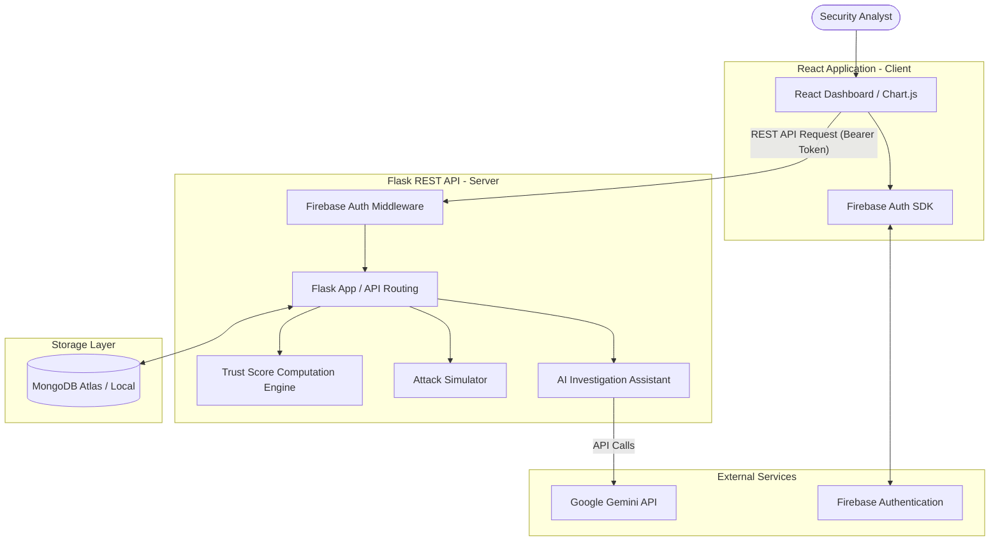

# GarudaAI System Architecture Design

This document details the high-level system architecture, request flows, computation models, and security design for GarudaAI.

---

## System Architecture



### Components

1. **Frontend (Client)**:
   - React application styled with Tailwind CSS.
   - Leverages Chart.js to render interactive trust score history trends and analytics.
   - Integrates the Firebase Client SDK to manage analyst sign-ins, tokens, and active sessions.

2. **Backend (Server)**:
   - Python Flask REST API exposes logical endpoints.
   - Authentication Middleware parses and verifies incoming Firebase JSON Web Tokens (JWT) using `firebase-admin`.
   - AI Investigation Assistant communicates server-side with Gemini API using the official `google-generativeai` SDK. **Crucial Security Rule**: The Gemini API key is never exposed to the frontend client.

3. **Database (Storage)**:
   - MongoDB Atlas (or local MongoDB for development) stores collections for employees, logs (events), calculated trust scores, alerts, and active simulation states.

---

## Core Request Flows

### Loop 1: Dashboard Load
```
React Client                 Flask Backend                MongoDB
    |                              |                         |
    |--- GET /api/employees ------>|                         |
    |    (Bearer Token)            |--- Query all profiles ->|
    |                              |<-- Return list --------|
    |<-- JSON Employee List -------|                         |
```
- Frontend pulls the list of employees along with their current pre-computed cached trust scores.

### Loop 2: Alert Click & Investigation
```
React Client                 Flask Backend                MongoDB               Gemini API
    |                              |                         |                      |
    |--- GET /api/alerts/:id ---->|                         |                      |
    |                              |--- Fetch Alert Metadata>|                      |
    |                              |<-- Return Alert --------|                      |
    |                              |--- Fetch employee logs >|                      |
    |                              |<-- Return Timeline -----|                      |
    |                              |-- Check cached explanation --                  |
    |                              |   If cache missed:            |                |
    |                              |----------------- Send Context -------------->|
    |                              |<---------------- Return Narrative -----------|
    |                              |-- Cache narrative -----|                      |
    |<-- Timeline & AI Explanation |                         |                      |
```
- Provides instant context to the analyst by loading pre-grouped timelines alongside a Gemini-authored risk evaluation.

### Loop 3: Simulator Trigger & Live Recalculation
```
React Client                 Flask Backend                MongoDB                 React Client (WS / Poll)
    |                              |                         |                               |
    |--- POST /api/simulate ------>|                         |                               |
    |    (Scenario Name)           |--- Write threat events >|                               |
    |                              |--- Trigger Score Engine |                               |
    |                              |    Recompute & Store  ->|                               |
    |                              |--- Create Alert Data ->|                               |
    |                              |                         |                               |
    |<-- HTTP 200 (Success) -------|                         |                               |
    |                              |                         |                               |
    |--- Poll or Auto-Refresh ------------------------------>|--- Fetch Updated Dashboard -->|
```
- Recalculates scores immediately when new log writes occur, saving calculation time on read.

---

## Score Computation Model

### Selection: Write-Time Recalculation with Caching
To optimize performance for hackathon constraints, we choose a **Write-Time Recalculation (Batch/Delta-on-Write)** model. 

- **Why**: Read operations (loading dashboards, searching profiles) must execute with sub-second latency. Performing complex multi-collection pipeline joins and time-decay iterations across thousands of history rows on-read would choke the Flask API.
- **How**:
  - Every time the simulator writes a log, or when the data import pipeline adds new data, a recalculation routine is invoked.
  - The calculated score is saved directly onto the employee's document in the `employees` collection (as the `current_score`) and a historical snapshot is appended to the `trust_scores` collection.
  - Read endpoints merely query the cached fields.

---

## Environment Configuration

Secrets are managed via environmental variables. The backend requires credentials for MongoDB, Firebase, and Gemini.

See the configured keys in [.env.example](file:///c:/Users/PRathmesh/Desktop/FINSpark/.env.example).
