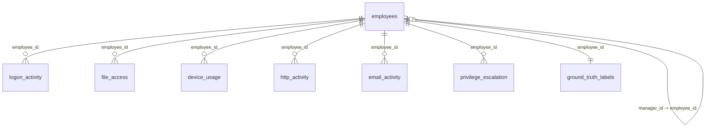

# SentinelAI Dataset Analysis

This document provides a detailed overview of the synthetic dataset generated for the SentinelAI Behavior Trust Score & Insider Threat Detection platform.

---

## Dataset Catalog

### 1. `employees.csv`
- **Purpose**: Baseline identity registry mapping active employees, organizational roles, and locations.
- **Columns**:
  - `employee_id` (Primary Key): Unique code (e.g., `EMP001`, `EMP002`).
  - `full_name`: Employee name.
  - `department`: Department (Engineering, HR, Finance, Sales, Executive).
  - `role`: Title of employee (e.g., Software Engineer, DevOps, CFO).
  - `seniority_level`: Junior, Mid, Senior, Executive.
  - `is_privileged_user`: Boolean string (`True`/`False`) indicating elevated logical access (system admins, senior developers, finance).
  - `hire_date`: Date joined (YYYY-MM-DD).
  - `manager_id` (Foreign Key -> `employees.employee_id`): Direct supervisor ID.
  - `office_location`: Corporate office (New York, San Francisco, London, Tokyo, Bengaluru).

### 2. `logon_activity.csv`
- **Purpose**: Authentications log capturing login/logout events.
- **Columns**:
  - `event_id` (Primary Key): Unique log identifier.
  - `employee_id` (Foreign Key -> `employees.employee_id`): Employee performing login.
  - `timestamp`: Date and time of authentication (YYYY-MM-DD HH:MM:SS).
  - `device_id`: Identifier of the terminal used.
  - `login_type`: Interactive, Remote, or Disconnect.
  - `is_after_hours`: Boolean string (`True`/`False`) flag for times outside core office windows (7 PM - 6 AM).
  - `location`: Geo-location or branch office IP location.
  - `is_known_device`: Boolean string (`True`/`False`) flag indicating if device matches employee profile registry.

### 3. `file_access.csv`
- **Purpose**: File operations audited on servers, file shares, and local terminals.
- **Columns**:
  - `event_id` (Primary Key): Unique audit log identifier.
  - `employee_id` (Foreign Key -> `employees.employee_id`): Author of file action.
  - `timestamp`: Date and time of the file access.
  - `file_name`: String containing filename with extension.
  - `file_sensitivity`: Public, Internal, Confidential, Restricted.
  - `action`: Read, Write.
  - `file_size_mb`: File payload size in megabytes.

### 4. `device_usage.csv`
- **Purpose**: USB flash drive insertions/removals and physical file transfers.
- **Columns**:
  - `event_id` (Primary Key): Unique event code.
  - `employee_id` (Foreign Key -> `employees.employee_id`): Employee operating the device.
  - `timestamp`: Connection/disconnection time.
  - `device_type`: "USB Drive".
  - `action`: Connect, Disconnect.
  - `data_transferred_mb`: Copied data size in megabytes (non-zero during 'Connect' operations representing copy actions).

### 5. `http_activity.csv`
- **Purpose**: Outbound proxy logs tracking web domains visited.
- **Columns**:
  - `event_id` (Primary Key): Web request code.
  - `employee_id` (Foreign Key -> `employees.employee_id`): Web surfer identity.
  - `timestamp`: Navigation time.
  - `url_category`: Search, Technology, Social Media, News, Business, Entertainment, Job Search, Cloud Storage, Webmail.
  - `domain`: Fully qualified domain name (e.g., `github.com`, `mega.io`).

### 6. `email_activity.csv`
- **Purpose**: Mail transfer logs auditing outbound/inbound communications.
- **Columns**:
  - `event_id` (Primary Key): Mail identifier.
  - `employee_id` (Foreign Key -> `employees.employee_id`): Sender identity.
  - `timestamp`: Sent time.
  - `recipient_domain`: Domain of recipient (e.g., `gmail.com`, `competitor-defense.com`).
  - `has_attachment`: Boolean string (`True`/`False`).
  - `attachment_size_mb`: Size of files attached.

### 7. `privilege_escalation.csv`
- **Purpose**: Log of administrative privilege changes.
- **Columns**:
  - `event_id` (Primary Key): Escalation log code.
  - `employee_id` (Foreign Key -> `employees.employee_id`): Target employee.
  - `timestamp`: Change execution time.
  - `previous_access_level`: Role/Group prior to shift (e.g., User).
  - `new_access_level`: Upgraded permission level (e.g., Administrator).
  - `approved_by`: IT supervisor name or "SYSTEM_AUTO".
  - `justification_provided`: Human reason entered for audit.

### 8. `ground_truth_labels.csv`
- **Purpose**: Ground truth registry identifying known threats in the dataset for model and logic validation.
- **Columns**:
  - `employee_id` (Foreign Key -> `employees.employee_id`): Employee ID.
  - `is_insider_threat`: Boolean string (`True`/`False`) indicating active threat scenario presence.
  - `threat_pattern`: USB Theft, Mass File Download, Impossible Travel, Privilege Escalation, Midnight Login, or None.
  - `notes`: Summary description of the anomaly sequence.

---

## Join Graph (Key Relationships)

- `employees.employee_id` acts as the primary hub.
- All transactional activity datasets connect to `employees.employee_id` via a one-to-many relationship.
- Self-referencing join exists inside `employees` via `manager_id -> employee_id` to establish the reporting hierarchy.

---

## Mapping Data to Security Features

1. **Behavior Trust Score**:
   - Out-of-hours logins (`logon_activity`), unapproved devices, access to `Confidential` or `Restricted` documents (`file_access`), external email file transfers (`email_activity`), and privilege changes without sound justification (`privilege_escalation`) trigger configured deductions.
2. **Attack Timeline**:
   - Queries all transactional logs (Logon, File, Device, HTTP, Email, Escalation) for a single `employee_id`, ordered chronologically by `timestamp`.
3. **AI Investigation Assistant**:
   - Fed with the reconstructed chronological timeline and employee organizational metadata to generate narratives explaining the context, business risk, and recommended action.
4. **Smart Recommendations**:
   - Derived from specific activity categories (e.g., block USB, suspend account for impossible travel, flag for HR review upon intensive job searching).

---

## MVP Scoping & Data Quality Caveats

- **Essential Datasets (MVP)**:
  - `employees`: Crucial for identity and routing.
  - `logon_activity`, `file_access`, `device_usage`: Required for the core risk vectors (After-hours logins, unauthorized exfiltration, data harvesting).
  - `ground_truth_labels`: Crucial for validating the scoring engine algorithms.
- **Deferrable Datasets (Phase 2 / Extensions)**:
  - `http_activity` and `email_activity` add flavor but could be simplified or simulated if memory constraints are hit.
- **Data-Quality Caveats**:
  - Synthetic times are internally consistent across logs for designated threat scenarios, but normal activity uses random distributions. This means standard users may have minor anomalous overlaps, which mirrors real-world security noise.
